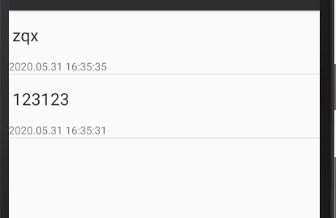

# 期中作业 notepad


1增加时间戳显示

2.添加笔记搜索功能


## 添加时间戳


在noteslist_item.xml添加textview

```
<TextView xmlns:android="http://schemas.android.com/apk/res/android"    android:id="@+id/text1_time"   
android:layout_width="match_parent"  
android:layout_height="match_parent" 
android:singleLine="true" />
```

在NotePadProvider.java和NoteEditor.java中标准化时间类型

在notepad provider类

主要代码

```
        Date date = new Date(now);
        SimpleDateFormat format = new SimpleDateFormat("yyyy.MM.dd HH:mm:ss");
        String dateTime = format.format(date);
        if (values.containsKey(NotePad.Notes.COLUMN_NAME_CREATE_DATE) == false) {
            values.put(NotePad.Notes.COLUMN_NAME_CREATE_DATE, dateTime);
        }
```
修改Note Editor类

```
values.put(NotePad.Notes.COLUMN_NAME_MODIFICATION_DATE,System.currentTimeMillis());
修改为
 Long now = Long.valueOf(System.currentTimeMillis());
        Date date = new Date(now);
        SimpleDateFormat format = new SimpleDateFormat("yyyy.MM.dd HH:mm:ss");
        String dateTime = format.format(date);
        values.put(NotePad.Notes.COLUMN_NAME_MODIFICATION_DATE, dateTime);
```

### 运行结果
## 

## 修改文本后


### 添加笔记搜索功能
1. 在menu中添加一个搜索按钮
```
    <item
        android:id="@+id/menu_search"
        android:title="@string/menu_search"
        android:icon="@android:drawable/ic_search_category_default"
        android:showAsAction="always">
    </item>
```
2. 新建note_search.xml，定义查询界面的布局
```
<?xml version="1.0" encoding="utf-8"?>
<LinearLayout xmlns:android="http://schemas.android.com/apk/res/android"
    android:orientation="vertical" android:layout_width="match_parent"
    android:layout_height="match_parent">
    <SearchView
        android:id="@+id/search_view"
        android:layout_width="match_parent"
        android:layout_height="wrap_content"
        android:iconifiedByDefault="false"
        android:queryHint="输入笔记标题..."
        android:layout_alignParentTop="true">
    </SearchView>
    <ListView
        android:id="@android:id/list"
        android:layout_width="match_parent"
        android:layout_height="wrap_content">
    </ListView>
</LinearLayout>
```


1. 新建NoteSearch
```
package com.example.android.notepad;

import android.app.ListActivity;
import android.content.ContentUris;
import android.content.Intent;
import android.database.Cursor;
import android.net.Uri;
import android.os.Bundle;
import android.view.View;
import android.widget.ListView;
import android.widget.SearchView;
import android.widget.SimpleCursorAdapter;

public class NoteSearch extends ListActivity implements SearchView.OnQueryTextListener {
    private static final String[] PROJECTION = new String[] {
            NotePad.Notes._ID, // 0
            NotePad.Notes.COLUMN_NAME_TITLE, // 1
            //扩展 显示时间 颜色
            NotePad.Notes.COLUMN_NAME_MODIFICATION_DATE, // 2
         //   NotePad.Notes.COLUMN_NAME_BACK_COLOR
    };
    @Override
    protected void onCreate(Bundle savedInstanceState) {
        super.onCreate(savedInstanceState);
        setContentView(R.layout.note_search);
        Intent intent = getIntent();
        if (intent.getData() == null) {
            intent.setData(NotePad.Notes.CONTENT_URI);
        }
        SearchView searchview = (SearchView)findViewById(R.id.search_view);
        //为查询文本框注册监听器
        searchview.setOnQueryTextListener(NoteSearch.this);
    }
    @Override
    public boolean onQueryTextSubmit(String query) {
        return false;
    }
    @Override
    public boolean onQueryTextChange(String newText) {
        //搜索语句，搜索结果存放在cursor中，使用SimpleCursorAdapter进行数据的装填
        String selection = NotePad.Notes.COLUMN_NAME_TITLE + " Like ? ";
        String[] selectionArgs = { "%"+newText+"%" };
        Cursor cursor = managedQuery(
                getIntent().getData(),            // Use the default content URI for the provider.
                PROJECTION,                       // Return the note ID and title for each note. and modifcation date
                selection,                        // 条件左边
                selectionArgs,                    // 条件右边
                NotePad.Notes.DEFAULT_SORT_ORDER  // Use the default sort order.
        );
        String[] dataColumns = { NotePad.Notes.COLUMN_NAME_TITLE ,  NotePad.Notes.COLUMN_NAME_MODIFICATION_DATE };
        int[] viewIDs = { android.R.id.text1 , R.id.text1_time };
        SimpleCursorAdapter adapter = new SimpleCursorAdapter(
                this,
                R.layout.noteslist_item,
                cursor,
                dataColumns,
                viewIDs
        );
        setListAdapter(adapter);
        return true;
    }
    @Override
    protected void onListItemClick(ListView l, View v, int position, long id) {
        // Constructs a new URI from the incoming URI and the row ID
        Uri uri = ContentUris.withAppendedId(getIntent().getData(), id);
        // Gets the action from the incoming Intent
        String action = getIntent().getAction();
        // Handles requests for note data
        if (Intent.ACTION_PICK.equals(action) || Intent.ACTION_GET_CONTENT.equals(action)) {
            // Sets the result to return to the component that called this Activity. The
            // result contains the new URI
            setResult(RESULT_OK, new Intent().setData(uri));
        } else {
            // Sends out an Intent to start an Activity that can handle ACTION_EDIT. The
            // Intent's data is the note ID URI. The effect is to call NoteEdit.
            startActivity(new Intent(Intent.ACTION_EDIT, uri));
        }
    }
}
```

### 运行结果


