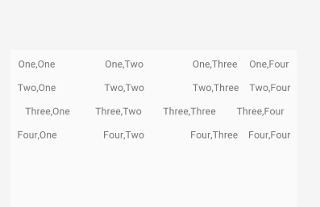
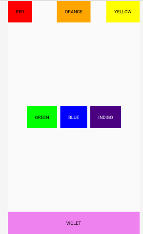
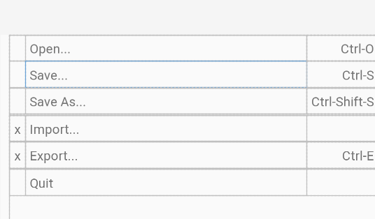

布局

## 线性布局

 

### 主要代码

<?xml version="1.0" encoding="utf-8"?>
<LinearLayout xmlns:android="http://schemas.android.com/apk/res/android"
    android:layout_width="match_parent"
    android:layout_height="wrap_content"
    android:orientation="vertical"
    android:padding="5dp">

    <LinearLayout
        android:layout_width="match_parent"
        android:layout_height="wrap_content"
        android:orientation="horizontal">
    
        <LinearLayout
            android:layout_width="wrap_content"
            android:layout_height="wrap_content"
            android:orientation="vertical">
    
            <TextView
                android:layout_width="match_parent"
                android:layout_height="wrap_content"
                android:layout_marginRight="5dp"
                android:background="@drawable/border"
                android:padding="5dp"
                android:text="One,One"
                android:textAlignment="center" />
    
            <TextView
                android:layout_width="wrap_content"
                android:layout_height="wrap_content"
                android:layout_marginRight="5dp"
                android:layout_marginTop="5dp"
                android:background="@drawable/border"
                android:padding="5dp"
                android:text="Two,One"
                android:textAlignment="center" />
        </LinearLayout>
    
        <LinearLayout
            android:layout_width="0dp"
            android:layout_height="wrap_content"
            android:layout_weight="1"
            android:orientation="vertical">
    
            <TextView
                android:layout_width="match_parent"
                android:layout_height="wrap_content"
                android:layout_marginRight="5dp"
                android:layout_weight="1"
                android:background="@drawable/border"
                android:padding="5dp"
                android:text="One,Two"
                android:textAlignment="center" />
    
            <TextView
                android:layout_width="match_parent"
                android:layout_height="wrap_content"
                android:layout_marginRight="5dp"
                android:layout_marginTop="5dp"
                android:layout_weight="1"
                android:background="@drawable/border"
                android:padding="5dp"
                android:text="Two,Two"
                android:textAlignment="center" />
        </LinearLayout>
    
        <LinearLayout
            android:layout_width="wrap_content"
            android:layout_height="wrap_content"
            android:orientation="vertical">
    
            <TextView
                android:layout_width="wrap_content"
                android:layout_height="wrap_content"
                android:layout_marginRight="5dp"
                android:background="@drawable/border"
                android:padding="5dp"
                android:text="One,Three"
                android:textAlignment="center" />
    
            <TextView
                android:layout_width="wrap_content"
                android:layout_height="wrap_content"
                android:layout_marginRight="5dp"
                android:layout_marginTop="5dp"
                android:background="@drawable/border"
                android:padding="5dp"
                android:text="Two,Three"
                android:textAlignment="center" />
    
        </LinearLayout>
    
        <LinearLayout
            android:layout_width="wrap_content"
            android:layout_height="wrap_content"
            android:orientation="vertical">
    
            <TextView
                android:layout_width="wrap_content"
                android:layout_height="wrap_content"
                android:background="@drawable/border"
                android:padding="5dp"
                android:text="One,Four"
                android:textAlignment="center" />
    
            <TextView
                android:layout_width="wrap_content"
                android:layout_height="wrap_content"
                android:layout_marginTop="5dp"
                android:background="@drawable/border"
                android:padding="5dp"
                android:text="Two,Four"
                android:textAlignment="center" />
        </LinearLayout>
    
    </LinearLayout>
    
    <LinearLayout
        android:layout_width="match_parent"
        android:layout_height="wrap_content"
        android:orientation="horizontal">
        <TextView
            android:layout_width="0dp"
            android:layout_height="wrap_content"
            android:layout_weight="1"
            android:layout_marginRight="5dp"
            android:layout_marginTop="5dp"
            android:background="@drawable/border"
            android:padding="5dp"
            android:text="Three,One"
            android:textAlignment="center" />
        <TextView
            android:layout_width="0dp"
            android:layout_height="wrap_content"
            android:layout_weight="1"
            android:layout_marginRight="5dp"
            android:layout_marginTop="5dp"
            android:background="@drawable/border"
            android:padding="5dp"
            android:text="Three,Two"
            android:textAlignment="center" />
        <TextView
            android:layout_width="0dp"
            android:layout_height="wrap_content"
            android:layout_weight="1"
            android:layout_marginRight="5dp"
            android:layout_marginTop="5dp"
            android:background="@drawable/border"
            android:padding="5dp"
            android:text="Three,Three"
            android:textAlignment="center" />
        <TextView
            android:layout_width="0dp"
            android:layout_height="wrap_content"
            android:layout_weight="1"
            android:layout_marginTop="5dp"
            android:background="@drawable/border"
            android:padding="5dp"
            android:text="Three,Four"
            android:textAlignment="center" />
    </LinearLayout>
    <LinearLayout
        android:layout_width="match_parent"
        android:layout_height="wrap_content"
        android:orientation="horizontal"
        android:layout_marginTop="5dp">
        <TextView
            android:layout_width="wrap_content"
            android:layout_height="wrap_content"
            android:layout_marginRight="5dp"
            android:background="@drawable/border"
            android:padding="5dp"
            android:text="Four,One"
            android:textAlignment="center" />
        <TextView
            android:layout_width="0dp"
            android:layout_height="wrap_content"
            android:layout_weight="1"
            android:layout_marginRight="5dp"
            android:background="@drawable/border"
            android:padding="5dp"
            android:text="Four,Two"
            android:textAlignment="center" />
        <TextView
            android:layout_width="wrap_content"
            android:layout_height="wrap_content"
            android:layout_marginRight="5dp"
            android:background="@drawable/border"
            android:padding="5dp"
            android:text="Four,Three"
            android:textAlignment="center" />
        <TextView
            android:layout_width="wrap_content"
            android:layout_height="wrap_content"
            android:background="@drawable/border"
            android:padding="5dp"
            android:text="Four,Four"
            android:textAlignment="center" />
    </LinearLayout>
    </LinearLayout>




## 约束布局

 

### 主要代码

```
<?xml version="1.0" encoding="utf-8"?>
<RelativeLayout xmlns:android="http://schemas.android.com/apk/res/android"
    android:layout_width="match_parent"
    android:layout_height="match_parent">
    <TextView
        android:text="RED"
        android:id="@+id/TextView01"
        android:layout_height="wrap_content"
        android:background="#f00"
        android:gravity="center"
        android:textColor="#000"
        android:layout_width="wrap_content"
        android:padding="25dp"></TextView>


    <TextView
        android:text="ORANGE"
        android:layout_height="wrap_content"
        android:background="#ffa500"
        android:gravity="center"
        android:textColor="#000"
        android:id="@+id/TextView02"
        android:layout_width="wrap_content"
        android:layout_centerHorizontal="true"
        android:padding="25dp"></TextView>


    <TextView
        android:text="YELLOW"
        android:layout_height="wrap_content"
        android:background="#ffff00"
        android:gravity="center"
        android:textColor="#000"
        android:id="@+id/TextView03"
        android:layout_width="wrap_content"
        android:layout_alignParentRight="true"
        android:padding="25dp"></TextView>


    <TextView
        android:text="GREEN"
        android:layout_height="wrap_content"
        android:background="#0f0"
        android:gravity="center"
        android:textColor="#000"
        android:id="@+id/TextView04"
        android:layout_width="wrap_content"
        android:layout_toLeftOf="@+id/TextView05"
        android:padding="25dp"
        android:layout_centerVertical="true"></TextView>


    <TextView
        android:text="BLUE"
        android:layout_height="wrap_content"
        android:background="#00f"
        android:gravity="center"
        android:textColor="#fff"
        android:id="@+id/TextView05"
        android:layout_width="wrap_content"
        android:layout_centerInParent="true"
        android:layout_margin="10dp"
        android:padding="25dp"></TextView>


    <TextView
        android:text="INDIGO"
        android:layout_height="wrap_content"
        android:gravity="center"
        android:textColor="#fff"
        android:id="@+id/TextView06"
        android:layout_width="wrap_content"
        android:layout_toRightOf="@+id/TextView05"
        android:background="#4b0082"
        android:padding="25dp"
        android:layout_centerVertical="true"></TextView>


    <TextView
        android:text="VIOLET"
        android:layout_height="wrap_content"
        android:background="#ee82ee"
        android:gravity="center"
        android:textColor="#000"
        android:id="@+id/TextView07"
        android:layout_alignParentBottom="true"
        android:layout_width="fill_parent"
        android:padding="25dp"></TextView>

</RelativeLayout>
```



## 表格布局

 <?xml version="1.0" encoding="utf-8"?>
<TableLayout xmlns:android="http://schemas.android.com/apk/res/android"
    android:layout_width="match_parent"
    android:layout_height="match_parent"
    android:layout_marginLeft="10dp"
    android:stretchColumns="1">

    <TableRow>
    
        <TextView
            android:layout_column="1"
            android:padding="5dp"
            android:text="Open..." />
    
        <TextView
            android:gravity="right"
            android:padding="5dp"
            android:text="Ctrl-O" />
    </TableRow>
    
    <TableRow>
    
        <TextView
            android:layout_column="1"
            android:padding="5dp"
            android:text="Save..." />
    
        <TextView
            android:gravity="right"
            android:padding="5dp"
            android:text="Ctrl-S" />
    </TableRow>
    
    <TableRow>
    
        <TextView
            android:layout_column="1"
            android:padding="5dp"
            android:text="Save As..." />
    
        <TextView
            android:gravity="right"
            android:padding="5dp"
            android:text="Ctrl-Shift-S" />
    </TableRow>
    
    <View
        android:layout_height="1dp"
        android:background="#FFFFFF" />
    
    <TableRow>
    
        <TextView
            android:padding="5dp"
            android:text="x" />
    
        <TextView
            android:layout_column="1"
            android:padding="5dp"
            android:text="Import..." />
    
    </TableRow>
    
    <TableRow>
    
        <TextView
            android:padding="5dp"
            android:text="x" />


        <TextView
            android:layout_column="1"
            android:padding="5dp"
            android:text="Export..." />
    
        <TextView
            android:gravity="right"
            android:padding="5dp"
            android:text="Ctrl-E" />
    
    </TableRow>
    
    <View
        android:layout_height="1dp"
        android:background="#FFFFFF" />
    
    <TableRow>
    
        <TextView
            android:layout_column="1"
            android:padding="5dp"
            android:text="Quit" />
    </TableRow>
    </TableLayout>
### 主要代码

