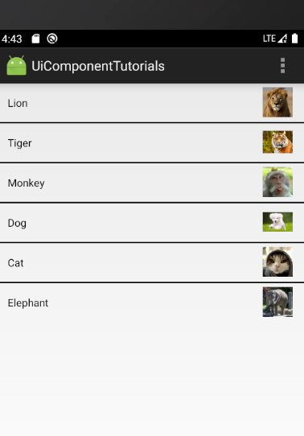
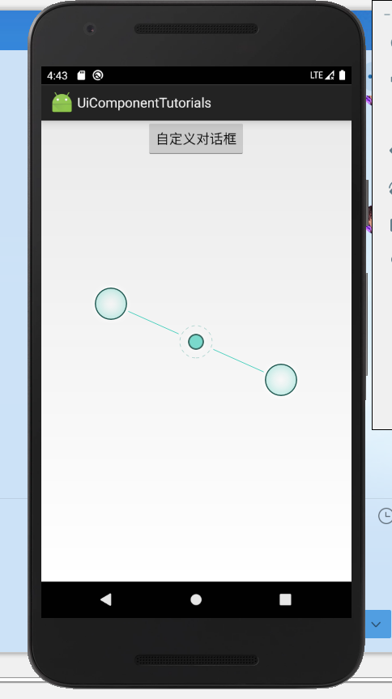
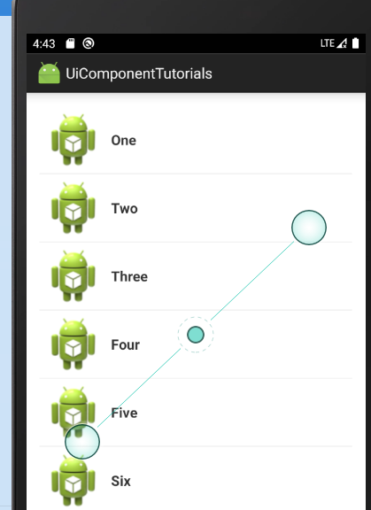

本次实验完成实验三的简单适配器、自定义对话框、xml定义菜单以及上下文菜单实验。本次实验采取的是一个主界面通过intent在不同页面之间的跳转，与实验二 形成比较明显的区别，无需手动进行改代码运行工程，只需点击不同的按钮即可。接下来展示的是启动界面及各界面的布局以及部分代码，若想查看 更多请自行查看仓库下本工程的布局文件代码。

## Android ListView的用法

#### 

```
<ListView
    android:id="@+id/simpleListView"
    android:layout_width="match_parent"
    android:layout_height="wrap_content"
    android:divider="#000"
    android:dividerHeight="2dp"
    android:listSelector="#600"/>
```

## 创建自定义布局的AlertDialog



```
<LinearLayout xmlns:android="http://schemas.android.com/apk/res/android"
	android:orientation="vertical"
	android:layout_width="wrap_content"
	android:layout_height="wrap_content">
    <ImageView
        android:src="@drawable/header_logo"
        android:layout_width="match_parent"
        android:layout_height="64dp"
        android:scaleType="center"
        android:background="#FFFFBB33"
        android:contentDescription="@string/app_name" />
    <EditText
        android:id="@+id/username"
        android:inputType="textEmailAddress"
        android:layout_width="match_parent"
        android:layout_height="wrap_content"
        android:layout_marginTop="16dp"
        android:layout_marginLeft="4dp"
        android:layout_marginRight="4dp"
        android:layout_marginBottom="4dp"
        android:hint="@string/username" />
    <EditText
        android:id="@+id/password"
        android:inputType="textPassword"
        android:layout_width="match_parent"
        android:layout_height="wrap_content"
        android:layout_marginTop="4dp"
        android:layout_marginLeft="4dp"
        android:layout_marginRight="4dp"
        android:layout_marginBottom="16dp"
        android:fontFamily="sans-serif"
        android:hint="@string/password"/>
</LinearLayout>
```

## 使用XML定义菜单


```
<menu xmlns:android="http://schemas.android.com/apk/res/android">
    <item android:title="@string/menu_Font">
        <menu>
            <item
                android:id="@+id/menu_font_small"
                android:title="@string/menu_font_small"/>
            <item
                android:id="@+id/menu_font_middle"
                android:title="@string/menu_font_middle"/>
            <item
                android:id="@+id/menu_font_big"
                android:title="@string/menu_font_big"/>
        </menu>

    </item>
    <item
        android:id="@+id/menu_normal"
        android:title="@string/menu_Normal">
    </item>
    <item android:title="@string/menu_Color">
        <menu>
            <item
                android:id="@+id/menu_color_red"
                android:title="@string/menu_color_red" />
            <item
                android:id="@+id/menu_color_black"
                android:title="@string/menu_color_black"/>
        </menu>
    </item>
</menu>
```

## 创建ActionMode的上下文菜单



```
ListView listView = getListView();
listView.setChoiceMode(ListView.CHOICE_MODE_MULTIPLE_MODAL);
listView.setMultiChoiceModeListener(new MultiChoiceModeListener() {

    @Override
    public void onItemCheckedStateChanged(ActionMode mode, int position,
                                          long id, boolean checked) {
        // Here you can do something when items are selected/de-selected,
        // such as update the title in the CAB
    }

    @Override
    public boolean onActionItemClicked(ActionMode mode, MenuItem item) {
        // Respond to clicks on the actions in the CAB
        switch (item.getItemId()) {
            case R.id.menu_delete:
                deleteSelectedItems();
                mode.finish(); // Action picked, so close the CAB
                return true;
            default:
                return false;
        }
    }

    @Override
    public boolean onCreateActionMode(ActionMode mode, Menu menu) {
        // Inflate the menu for the CAB
        MenuInflater inflater = mode.getMenuInflater();
        inflater.inflate(R.menu.context, menu);
        return true;
    }

    @Override
    public void onDestroyActionMode(ActionMode mode) {
        // Here you can make any necessary updates to the activity when
        // the CAB is removed. By default, selected items are deselected/unchecked.
    }

    @Override
    public boolean onPrepareActionMode(ActionMode mode, Menu menu) {
        // Here you can perform updates to the CAB due to
        // an invalidate() request
        return false;
    }
});
```